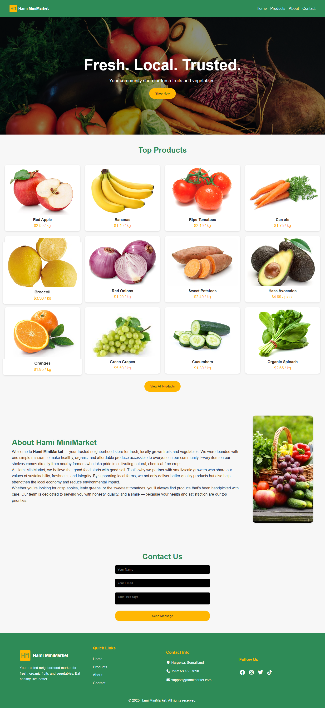

# Hami MiniMarket

A compact full‑stack mini e-commerce application (frontend + backend). Users can browse and filter products, manage a shopping cart persisted in LocalStorage, and place orders that are saved to a Node/Express + MongoDB backend.

--

## Project Preview

 <p align="center">  </p>

## Table of contents

- [About](#about)
- [Live Demo](#live-demo)
- [Features](#features)
- [Tech Stack](#tech-stack)
- [Project structure](#project-structure)
- [Getting started (Local)](#getting-started-local)
  - [Prerequisites](#prerequisites)
  - [Backend (API)](#backend-api)
  - [Frontend (Client)](#frontend-client)
- [API Endpoints](#api-endpoints)
- [Environment variables](#environment-variables)
- [Development notes](#development-notes)
- [Contributing](#contributing)
- [License & Contact](#license--contact)

## About

Built during the HamiSkills Web Development Internship (Week 1-4). The project demonstrates a simple multi-page client (HTML/CSS/vanilla JS with ES6 modules) and a minimal REST API (Node.js + Express + MongoDB with Mongoose).

## Live Demo

- Frontend: https://hamimm.vercel.app
- Backend API: https://hamimm.onrender.com

## Features

- Frontend

  - Product listing with search, category and price filters
  - Responsive product grid and lazy image loading
  - Shopping cart: add/remove items, adjust quantity, clear cart
  - Cart state persisted in LocalStorage; floating cart count
  - Order summary page with subtotal, tax (5%), final total and order confirmation

- Backend
  - REST endpoints for products and orders
  - MongoDB (Mongoose) models for `Product` and `Order`
  - Simple controller/route structure (MVC-like)

## Tech Stack

- Frontend: HTML5, CSS3 (Grid/Flexbox), JavaScript (ES6 modules)
- Backend: Node.js, Express
- Database: MongoDB (Mongoose)
- Other: CORS, dotenv (env loader)

## Project structure

```
hami-minimarket/
├── .gitignore
├── README.md
├── backend/
│   ├── config/
│   │   └── db.js
│   ├── controllers/
│   │   ├── orderController.js
│   │   └── productController.js
│   ├── lib/
│   │   └── env.js
│   ├── models/
│   │   ├── Order.js
│   │   └── Product.js
│   ├── package-lock.json
│   ├── package.json
│   ├── routes/
│   │   ├── orderRoutes.js
│   │   └── productRoutes.js
│   └── server.js
├── frontend/
│   ├── assets/
│   │   ├── favicon.ico
│   │   ├── logo.png
│   │   └── preview.png
│   ├── css/
│   │   ├── order.css
│   │   └── style.css
│   ├── index.html
│   ├── js/
│   │   ├── cart.js
│   │   ├── config.js
│   │   ├── order.js
│   │   ├── products.js
│   │   ├── script.js
│   │   └── storage.js
│   ├── order.html
│   └── products.html
└── package.json
```

## Getting started (Local)

### Prerequisites

- Node.js (v14+ recommended)
- npm
- MongoDB instance (local or cloud Atlas)

### Backend (API)

1. Install dependencies:

```bash
cd backend
npm install
```

2. Create a `.env` file inside `backend/` with the following vars:

```
MONGO_URI=your_mongodb_connection_string
PORT=5000
```

3. Start the server:

```bash
npm start
```

The backend will run by default on `http://localhost:5000` (or the `PORT` you set).

### Frontend (Client)

Open `frontend/index.html` in your browser, or serve the `frontend/` folder using Live Server or any static server:

```bash
# from project root (optional):
npx http-server frontend -p 8080
# or use VS Code Live Server
```

## API Endpoints

All API endpoints are prefixed with `/api` (default server base: `http://localhost:5000`).

| Method | Endpoint      | Description        |
| ------ | ------------- | ------------------ |
| GET    | /api/products | Fetch all products |
| POST   | /api/products | Add a new product  |
| GET    | /api/orders   | Fetch all orders   |
| POST   | /api/orders   | Create a new order |

## Environment variables

Place these in `backend/.env`:

- `MONGO_URI` — MongoDB connection string
- `PORT` — Server port (defaults to 5000)

## Development notes

- Frontend state: cart is stored in `localStorage` using helper `storage.js`.
- Tax is calculated at 5% on the order summary page.
- The backend uses `lib/env.js` to load environment variables and `config/db.js` to connect to MongoDB.

## Contributing

1. Fork the repo
2. Create a branch `feature/your-feature`
3. Make changes and open a PR

Please open issues or pull requests for improvements, bug fixes, or questions.

## License & Contact

This repository does not specify a license. If you want to reuse code, please contact the author.

Author: Yaasir Hassan — [HamiSkills Web Development Track](https://www.hamiskills.dev/)
